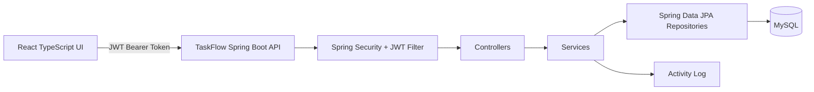
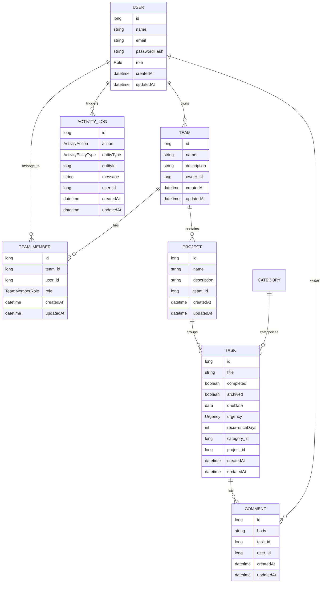
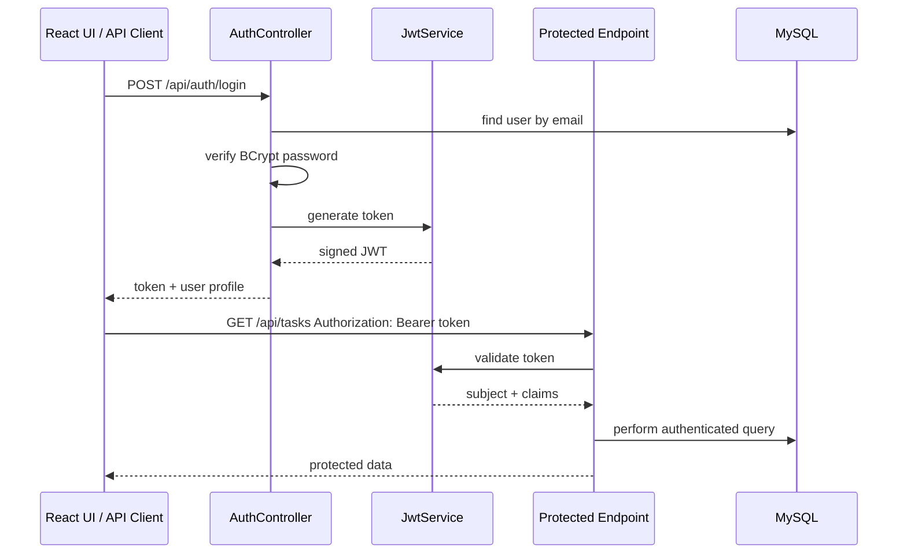
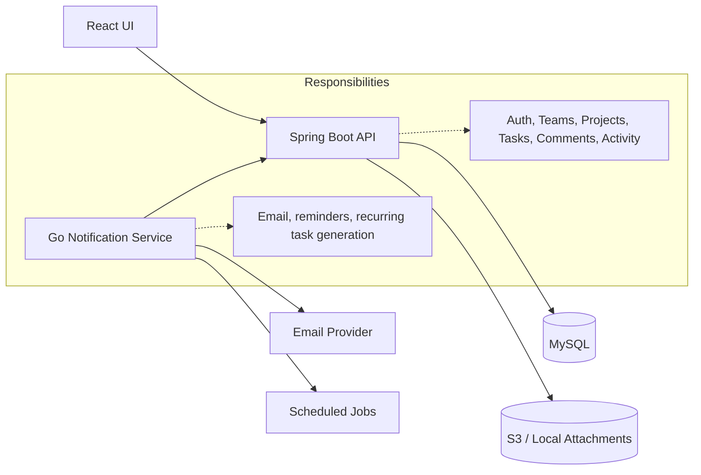

# TaskFlow API

> **Spring Boot REST API for a team-based task management platform.**
>
> TaskFlow started as a task CRUD application and is being evolved into a portfolio-ready SaaS-style product with authentication, teams, projects, tasks, comments, activity logging, and a clear path toward notifications, attachments, Docker, AWS deployment, and a Go notification worker.

## Why this project exists

TaskFlow is designed to demonstrate more than basic CRUD. It shows how a backend can grow from a single-user task app into a multi-tenant team productivity platform with domain boundaries, JWT authentication, relational modelling, validation, pagination, filtering, and audit-style activity logs.

For recruiters and technical reviewers, this API highlights practical backend skills that are directly relevant to production teams:

- REST API design with clear resource boundaries.
- Layered Spring Boot architecture.
- JWT-based stateless authentication.
- MySQL persistence with JPA/Hibernate.
- DTO-driven request/response contracts.
- Validation and consistent API error responses.
- Team and membership modelling for SaaS-style access control.
- Paginated and filtered task querying.
- Activity logging for traceability.
- Development seed data for predictable demos.

## Tech stack

| Area | Technology |
| --- | --- |
| Language | Java 21 |
| Framework | Spring Boot 4 |
| API | Spring Web MVC |
| Persistence | Spring Data JPA, Hibernate |
| Database | MySQL |
| Security | Spring Security, JWT using JJWT |
| Validation | Jakarta Bean Validation |
| Build | Maven Wrapper |
| Testing | Spring Boot test dependencies |
| Dev data | CommandLineRunner seed data and JavaFaker |

## High-level architecture



The backend follows a conventional but production-relevant layered structure:

```text
Controller -> Service -> Repository -> Entity -> Database
              |
              +-> DTO mapping, validation, permissions, activity logging
```

## Domain model



## Current feature set

### Authentication and users

- User registration.
- Login with email and password.
- Password hashing with BCrypt.
- JWT token generation.
- JWT request authentication filter.
- `/users/me` endpoint for current authenticated user.
- Role field on users: `ADMIN`, `MANAGER`, `MEMBER`.

### Teams and memberships

- Create teams.
- List teams for the authenticated user.
- View a single team.
- Update and delete teams.
- Team creator becomes `OWNER`.
- Add team members by email.
- Member roles: `OWNER`, `ADMIN`, `MEMBER`.
- Update member roles.
- Remove team members.
- Unique team membership constraint per team/user pair.

### Projects

- Create projects under a team.
- List projects across the authenticated user's teams.
- List projects for a specific team.
- View, update, and delete projects.
- Project responses include `teamId` and `teamName`.
- Duplicate project names are scoped to a team rather than globally.

### Tasks

- Create tasks.
- Update tasks.
- Archive tasks instead of hard deleting them from normal views.
- Duplicate tasks.
- Toggle completion through update.
- Assign category and optional project.
- Due date support.
- Urgency support: `LOW`, `MEDIUM`, `HIGH`.
- Recurrence interval field with validation.
- Overdue calculation.
- Pagination.
- Sorting by `createdAt`, `title`, `completed`, `dueDate`, and `urgency`.
- Filtering by category, project, completion, overdue status, due date range, and urgency.

### Categories

- Create categories.
- Update categories.
- Delete categories.
- List categories.
- Category validation and uniqueness checks.

### Comments

- Add comments to tasks.
- Update comments.
- Delete comments.
- Comments are linked to both task and user.

### Activity log

- Activity log service records important actions.
- Recent activity endpoint.
- Paginated activity endpoint.
- Logs actions across users, teams, projects, categories, tasks, and comments.

### Development seed data

The development profile seeds demo data so the project can be reviewed quickly after a database reset.

Current demo users:

| Name | Email | Password | Role |
| --- | --- | --- | --- |
| Admin User | `admin@taskflow.com` | `password123` | `ADMIN` |
| Project Manager | `manager@taskflow.com` | `password123` | `MANAGER` |
| Team Member One | `member1@taskflow.com` | `password123` | `MEMBER` |
| Team Member Two | `member2@taskflow.com` | `password123` | `MEMBER` |
| Demo Client | `client@taskflow.com` | `password123` | `MEMBER` |

The dev seed also creates sample categories and tasks for UI testing and demonstrations.

## API security flow



## API base URL

```text
http://localhost:8080/api
```

The backend is configured with:

```properties
server.port=8080
server.servlet.context-path=/api
```

## Endpoint overview

### Auth

| Method | Endpoint | Auth | Description |
| --- | --- | --- | --- |
| POST | `/auth/register` | Public | Register a new user and return JWT |
| POST | `/auth/login` | Public | Login and return JWT |

### Users

| Method | Endpoint | Auth | Description |
| --- | --- | --- | --- |
| GET | `/users/me` | Required | Get current authenticated user |

### Teams

| Method | Endpoint | Auth | Description |
| --- | --- | --- | --- |
| GET | `/teams` | Required | List teams for current user |
| GET | `/teams/{id}` | Required | Get team by id if user is a member |
| POST | `/teams` | Required | Create team and owner membership |
| PUT | `/teams/{id}` | Required | Update team |
| DELETE | `/teams/{id}` | Required | Delete team |
| GET | `/teams/{teamId}/members` | Required | List team members |
| POST | `/teams/{teamId}/members` | Required | Add member by email |
| PUT | `/teams/{teamId}/members/{memberId}/role` | Required | Update member role |
| DELETE | `/teams/{teamId}/members/{memberId}` | Required | Remove member |

### Projects

| Method | Endpoint | Auth | Description |
| --- | --- | --- | --- |
| GET | `/projects` | Required | List projects visible to current user, optionally by `teamId` |
| GET | `/projects?teamId={id}` | Required | List projects for one team |
| GET | `/teams/{teamId}/projects` | Required | Nested team project listing |
| GET | `/projects/{id}` | Required | Get project |
| POST | `/projects` | Required | Create project under a team |
| PUT | `/projects/{id}` | Required | Update project |
| DELETE | `/projects/{id}` | Required | Delete project |

### Categories

| Method | Endpoint | Auth | Description |
| --- | --- | --- | --- |
| GET | `/categories` | Required | List categories |
| GET | `/categories/paged` | Required | Paginated category listing |
| POST | `/categories` | Required | Create category |
| PUT | `/categories/{id}` | Required | Update category |
| DELETE | `/categories/{id}` | Required | Delete category |

### Tasks

| Method | Endpoint | Auth | Description |
| --- | --- | --- | --- |
| GET | `/tasks` | Required | List active tasks with filters |
| GET | `/tasks/paged` | Required | Paginated task listing |
| POST | `/tasks` | Required | Create task |
| PUT | `/tasks/{id}` | Required | Update task |
| DELETE | `/tasks/{id}` | Required | Archive task |
| POST | `/tasks/{id}/duplicate` | Required | Duplicate task, optionally shifting due date |

Supported task query options:

| Query param | Description |
| --- | --- |
| `category` | Filter by category id |
| `project` | Filter by project id |
| `sortBy` | `createdAt`, `title`, `completed`, `dueDate`, `urgency` |
| `order` | `ASC` or `DESC` |
| `completed` | `true` or `false` |
| `overdue` | `true` or `false` |
| `dueAfter` | ISO date, e.g. `2026-06-23` |
| `dueBefore` | ISO date, e.g. `2026-06-30` |
| `urgency` | `LOW`, `MEDIUM`, `HIGH` |
| `page` | Zero-based page number for paged endpoint |
| `size` | Page size, max 200 |

### Comments

| Method | Endpoint | Auth | Description |
| --- | --- | --- | --- |
| GET | `/tasks/{taskId}/comments` | Required | List comments for a task |
| POST | `/tasks/{taskId}/comments` | Required | Create comment on a task |
| PUT | `/comments/{id}` | Required | Update comment |
| DELETE | `/comments/{id}` | Required | Delete comment |

### Activity logs

| Method | Endpoint | Auth | Description |
| --- | --- | --- | --- |
| GET | `/activity-logs` | Required | Recent activity logs |
| GET | `/activity-logs/paged` | Required | Paginated activity logs |

## Request examples

### Register

```bash
curl -i -X POST http://localhost:8080/api/auth/register \
  -H "Content-Type: application/json" \
  -d '{"name":"Demo User","email":"demo@taskflow.com","password":"password123"}'
```

### Login

```bash
curl -i -X POST http://localhost:8080/api/auth/login \
  -H "Content-Type: application/json" \
  -d '{"email":"admin@taskflow.com","password":"password123"}'
```

### Use token

```bash
TOKEN="paste-token-here"

curl -i http://localhost:8080/api/users/me \
  -H "Authorization: Bearer $TOKEN"
```

### Create team

```bash
curl -i -X POST http://localhost:8080/api/teams \
  -H "Authorization: Bearer $TOKEN" \
  -H "Content-Type: application/json" \
  -d '{"name":"TaskFlow Demo Team","description":"Portfolio demo workspace"}'
```

### Create project under a team

```bash
curl -i -X POST http://localhost:8080/api/projects \
  -H "Authorization: Bearer $TOKEN" \
  -H "Content-Type: application/json" \
  -d '{"name":"Portfolio Build","description":"SaaS demo project","teamId":1}'
```

### Create task

```bash
curl -i -X POST http://localhost:8080/api/tasks \
  -H "Authorization: Bearer $TOKEN" \
  -H "Content-Type: application/json" \
  -d '{
    "title":"Build team dashboard",
    "completed":false,
    "categoryId":1,
    "projectId":1,
    "dueDate":"2026-06-30",
    "urgency":"HIGH",
    "recurrenceDays":7
  }'
```

## Local setup

### Prerequisites

- Java 21
- MySQL 8+
- Git Bash, PowerShell, or terminal
- Maven Wrapper is included, so a global Maven install is not required

### Environment variables

Create `.env` in the backend project root:

```properties
DB_PORT=3306
DB_HOST=localhost
DB_NAME=task_db
DB_USER=root
DB_PASSWORD=MyPass
JWT_SECRET=change-this-to-a-long-secure-secret-key-at-least-32-characters
JWT_EXPIRATION_MS=86400000
```

### Run locally

Git Bash/macOS/Linux:

```bash
./mvnw spring-boot:run
```

PowerShell:

```powershell
./mvnw.cmd spring-boot:run
```

### Run tests

```bash
./mvnw test
```

## Development profile note

The project currently uses the `dev` profile by default. In development, the database may be configured to recreate schema and seed demo data. This is useful for fast portfolio demonstrations, but production would use migrations such as Flyway or Liquibase and disable destructive schema recreation.

## Error response style

The API returns structured error responses for validation and not-found scenarios.

Example:

```json
{
  "message": "Service validation failed",
  "status": 400,
  "errorCode": "BAD_REQUEST",
  "details": {
    "teamId": ["Team ID is required"]
  },
  "path": "/api/projects",
  "timestamp": "2026-06-23T14:32:15"
}
```

## Project structure

```text
src/main/java/com/example/task
├── activitylog       # ActivityLog entity, service, controller, response DTOs
├── auth              # Register/login controllers and authentication DTOs
├── category          # Category CRUD
├── comment           # Task comments
├── common            # Base entity, timestamps, errors, pagination, exceptions
├── config            # Development factories and seeders
├── project           # Team-scoped projects
├── security          # JWT service, JWT filter, Spring Security config
├── task              # Task CRUD, filtering, pagination, duplication, urgency
├── team              # Teams, memberships, member roles
├── user              # User entity, repository, /users/me
└── TasksApiApplication.java
```

## Recruiter highlights

This API demonstrates several production-oriented backend concepts:

- Multi-entity domain modelling rather than isolated CRUD tables.
- Team membership architecture suitable for future multi-tenant authorization.
- Clear REST boundaries with nested endpoints where useful.
- JWT authentication integrated with Spring Security filters.
- Validation-first service methods that protect entity integrity.
- Query flexibility through JPA specifications, pagination, sorting, and filters.
- Activity logging to support audit trails and product analytics.
- Demo seed data that makes the project easy to evaluate quickly.
- A realistic roadmap toward service decomposition with a future Go notification service.

## Roadmap

### In progress / next backend improvements

- Scope tasks more strictly through team membership via project/team ownership.
- Scope categories to teams.
- Add assignee and creator fields to tasks.
- Add notification entities and unread notification endpoints.
- Add file attachment metadata and local/S3-compatible storage.
- Add admin-only controls for activity logs and user management.
- Add Flyway/Liquibase migrations.
- Add Docker Compose for API + MySQL + UI.
- Add a Go notification service for reminders, recurring task generation, and scheduled jobs.

### Future service architecture



## Status

TaskFlow API is currently in active development. The core SaaS foundation is implemented: JWT authentication, users, teams, team memberships, team-scoped projects, tasks, categories, comments, and activity logs. The next development phase is tightening team-scoped authorization across tasks/categories and adding notification/attachment capabilities.
